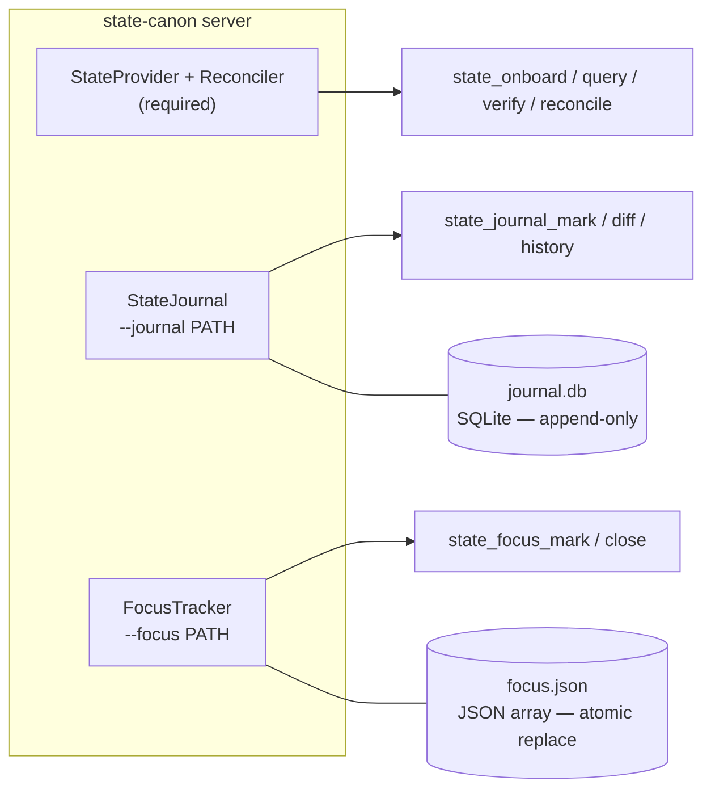

# state-canon MCP — extending & integrating

The tool/resource surface — `state_onboard` · `state_query` · `state_verify` · `state_reconcile`, plus the
`state://…` resources — is documented in the **[README](./README.md#what-it-is--a-canon-layer-exposed-over-mcp)**.
This document is the deeper reference: **extending** the tool (plugging in your own state) and **integrating**
it alongside other context sources.

## The abstraction — a generic provider (the real work)
The core is domain-agnostic; a user plugs in their own state:
- **`StateProvider`** (user implements): `list_domains()` · `query(domain, filter)` · `schema(domain)`
- **`Reconciler`** (user registers per domain): `observe(domain) -> reality` · `diff(declared, reality) -> [drift]`
  (the user supplies "how to observe reality"; the framework does the diff + drift typing)
- **`DigestAssembler`**: registered domains + a policy (what matters) → the compact onboard digest
- **MCP adapter**: thin wrapper exposing the tools/resources above over provider + reconciler

## Provider contract — the one rule that must hold

**Your `StateProvider` MUST represent the reconciled canon (what `observe()` returns), never the
declared/config side alone.** `state_verify` and `state_query` read `self.provider` directly — they do
not go through the `Reconciler` (only `state_reconcile` and the onboard digest compute `declared() vs
observe()` live). If a provider is wired to declared/config state instead, `state_verify` silently
checks claims against *aspiration*, not reality — a real "worker is running" can come back `holds:
false` with zero error signal, because the provider is comparing against what was supposed to happen,
not what actually did.

Every reference instance below gets this right (the provider is the reconciled product — e.g.
`sqlite_ops.py`'s DB is written by the reconciliation timers themselves, `microstack.py`'s provider
reads `synthesized/state.json`, not the raw manifest). Getting it wrong is easy for a *new* instance,
because nothing stops a `load()` from wiring `provider = JsonStateProvider("declared_config.json")` —
it will run, return results, and never look wrong.

**A structural safety net exists but is not a substitute for getting this right**: when a `Reconciler`
is registered for a domain, `state_verify` cross-checks the provider's data for that domain against the
reconciler's own `observe()` (matched by `key`, compared on `status_field`) and adds a `"warning"` field
to the response if they disagree. This catches the common case — declared/observed genuinely diverge —
but it's a diagnostic aid, not a guarantee: a domain with no registered reconciler gets no cross-check
at all, and `state_query` never cross-checks (it's the cheap, no-ground-truth-promised tool by design;
`state_verify` is the one that promises "don't trust the report").

## Reference instances (the abstraction has ≥3 instances from day one — proves it generalizes)

| instance | file | pattern |
|---|---|---|
| **Production ops canon** | `instances/sqlite_ops.py` | Mapped `SqliteStateProvider` over a live operations DB (domains: rules/services/components/chains/blockers/topology); host-side reconciliation timers write the DB. Real, live instance. |
| **microstack demo** | `corpus/microstack/` (loader in `instances/microstack.py`) | `JsonStateProvider` over `synthesized/state.json`; reconciler = `raw/manifest.txt` (declared) vs `raw/processes.txt` (reality). Reproducible token-cost experiment. |
| **Git worktree drift** | `state_canon/git_provider.py` (built-in, `--git PATH`) | Git's index/HEAD as *declared*, working tree as *observed* — `git status` becomes a typed drift report (mismatch / orphan / declared_but_missing). 17/17 checks. |
| **VSM task-file provider** | `instances/tasks_provider.py` (`--instance tasks_provider.py:PATH`) | Parses `task()`/`session()` blocks from `.vsm` files into domains `tasks`, `sessions`, `meta`, via `VsmStateProvider` (reloads on mtime change — a direct edit to the `.vsm` file is visible on the next query, not frozen at server startup). Co-located `current_focus.json` becomes a fallback `focus` domain; when the server is started with `--focus PATH`, `FocusTaskReconciler.bind_focus_tracker()` wires it to the SAME live `FocusTracker` `state_focus_mark` writes through, so `declared()` can't silently diverge from a different path or a stale snapshot. Two reconcilers: `TaskSessionReconciler` (domain `tasks` — flags open-but-resolved tasks) and `FocusTaskReconciler` (domain `focus` — flags stale focus entries: `stale_focus_task_done`, `stale_focus_session_resolved`), both reload their cached VSM parse on mtime change. 60/60 checks. |

All four are the same abstraction — `StateProvider` + `Reconciler` — wired through the same MCP server.
The list proves the pattern generalizes: SQLite, JSON, Git working trees, VSM notation — none of these
required a change to the core.

### Composable reconciler: freshness

`FreshnessReconciler` (`state_canon/freshness.py`) is a **composable** reconciler — it does **not** come with its own
provider or server flag. You import it into an **existing** instance's `load()` and add it to the returned
reconcilers list:

```python
from state_canon.freshness import FreshnessReconciler

def load(path: str):
    """Your instance's load() — tasks_provider, sqlite_ops, or any other."""

    provider, base_reconcilers = _existing_loader(path)

    reconcilers = [
        *base_reconcilers,
        FreshnessReconciler(
            path="/var/lib/vsf/state.db",
            max_age_seconds=86400,          # warn if older than 1 day
            domain="vsf-state-freshness",   # overrides default "freshness"
            label="VSF state DB",           # cosmetic label in drift message
        ),
    ]
    return provider, reconcilers
```

When the server runs, `state_reconcile` includes the freshness domain: no drift if the file is current,
a `missing` or `stale` drift if it isn't.

This is **opt-in by composition**, not by flag — there's no `--freshness` argument. Journal and focus
(below) are opt-in-by-flag because they add new *tools*; reconcilers only add new *drift domains* to the
existing `state_reconcile` tool, so composition is the right mechanism.

## Opt-in side systems: a repeating pattern

Journal and focus form a repeating architectural pattern — opt-in side systems that extend the server
without touching the provider:



Both opt-in flags share the same contract:
- **Enable**: add `--journal PATH` or `--focus PATH` to any server invocation
- **Tools**: the new tools appear in `tools/list` only when the flag is set
- **Error**: calling the tools without the flag returns a clear `"not enabled"` error
- **Read-back**: the side data is queryable through the same `state_query` dispatch
- **No provider coupling**: neither journal nor focus knows what provider the server was started with

With two real implementations, the pattern is proven — a third opt-in side system (e.g. an alarm
threshold tracker, an experiment log, a calibration ledger) would follow the same structure.

**Journal stats are pluggable, same as `DIGEST_POLICY`.** `StateJournal` tracks `drift_count`/`drifts`
generically (from whatever reconcilers the server was launched with), but the other snapshot columns
(`production_findings`, `by_severity`, `by_target`, `by_status`, `rag_accuracy`, `rag_feedback_total`)
have no fixed shape the core can assume — they stay zeroed unless your instance module exposes
`JOURNAL_STATS_FN` / `JOURNAL_RAG_FN` (zero-arg callables returning the stats dicts), fetched the same
way as `DIGEST_POLICY`: `getattr(mod, "JOURNAL_STATS_FN", None)`. This keeps domain-specific schema
knowledge (e.g. a `findings` table with particular columns) entirely inside the instance that actually
has that schema, not in the shared core.

## Roadmap instance: version control (Git first, VCS-agnostic by construction)

Version control integration is not a bolt-on — it is a *natural third instance*, because **git is
already a reconciler**: the index/HEAD is the *declared* state, the working tree is the *observed*
reality, and `git status` is a drift report. A `GitStateProvider` maps directly onto the existing
primitive, no new concepts:

| primitive | git realization |
|---|---|
| domains | `branches`, `status`, `log`, `tags`, `remotes` |
| declared | index / HEAD |
| observed | working tree (+ remote heads for ahead/behind) |
| `declared_but_missing` | deleted-in-worktree file |
| `orphan` | untracked file |
| `mismatch` | modified / staged-but-changed · branch ahead/behind its remote |
| `state_verify` | "is the tree clean? is `main` at `abc123`? is the tag signed?" |

VCS-agnostic falls out of the abstraction: the same domains implemented over jj/hg/svn is just
another provider — nothing in the core knows about git.

Second design direction: **versioning the state store itself** (state.json under git) gives
time-travel for free — `state_query(..., at=<revision>)`, and diffs *between* states become
first-class ("what changed since yesterday's digest?"). Both directions are roadmap, not v0.

## Remote mode: remote state, local server (and the alternative)

Sometimes the state cannot live beside the agent — ours doesn't: our production canon lives on a
server two SSH hops away from where the agent runs. Remote mode is supported, but at the **right
layer** — and the plug already exists.

**The recommended pattern — remote STATE, local SERVER.** The MCP server stays local beside the
agent (stdio, local-first); its `StateProvider` is what reaches over the wire. The provider
abstraction *is* the plug: `query()` can be implemented over HTTP (the `ApiStateProvider` example in the
[README](./README.md#onboarding-your-system--three-steps) is already remote mode), over SSH (a subprocess calling a remote query command — our own
production channel), over a message bus, gRPC — the core neither knows nor cares.
**Channel-agnostic by construction**, because the channel is entirely the provider's business.

| concern | where it lives |
|---|---|
| transport / channel (HTTP, SSH, bus, gRPC...) | your provider implementation |
| auth / credentials | your provider (env / keychain — never in MCP config args) |
| latency | per-query cost — consider caching the digest between calls |
| staleness | **declare it**: put `observed_at` / `reconciled_at` in `meta` so the agent *knows* the age of what it reads |
| write access | none — providers are read-only by contract, remote included |

**The alternative — remote MCP transport** (the MCP spec's streamable HTTP): moving the whole server
to the remote side. Possible, and the right call when *many agents share one state service* — but you
inherit service security (TLS, authz, exposure) and lose the local-first simplicity. v0 ships stdio
only; the remote-transport wrapper is a **developer integration point**, deliberately left open, not
a missing feature.

## Composing with other context artifacts (content RAG, memory, tools)

state-canon is deliberately **one instrument, not the whole rack**. The connection point already
exists and is the protocol itself: MCP clients attach servers side-by-side, so state-canon composes
with a content/vector RAG, a memory server, and any other tool without either knowing about the other.
What each source is *for* — and who wins when they disagree — is the part worth making explicit:

| source | answers | authoritative for |
|---|---|---|
| **state-canon** (this) | "what IS, right now" | current system truth (reconciled) |
| content / vector RAG | "what do we know about X" | knowledge, documents, how-tos |
| memory server | "what happened, what did we learn" | history, preferences, decisions past |
| other tools | "do X" | actuation — not context |

The discipline that keeps the ensemble honest is **authority ordering**: for *current* truth,
reconciled state outranks memory, and memory outranks the model's own recall — documents and memory
describe the intended or the past; the state describes what is. (In our own production system this is
a hard rule: *"when the state store disagrees with a memory file, the state store wins."*) Give your
agent that ordering explicitly — a line in the system prompt is enough.

v0 deliberately builds **no deeper coupling** — no cross-references from the digest into your document
store. If real usage asks for it, the roadmap shape is *content anchors on drift*: each drift kind
carrying a pointer into your knowledge base (the runbook for that failure class), so "what is wrong"
arrives together with "where it's documented". Whether that's wanted depends on the architecture each
user builds — the primitive stays minimal either way.

## How the 3 experiment conditions consume this
- **C0 cold** — NO MCP. Gets `raw/` only. The agent must *be* the reconciler (manual cross-reference).
- **C1 onboard** — `state://digest` injected as context. Front-load; zero exploration.
- **C2 MCP** — tools available. Lazy: query only the needed slice.

Closure worth noting: **C0 does by hand what the `Reconciler` does automatically; C2 queries the
`Reconciler`'s output.** The token delta = the cost of manual reconciliation. That *is* the value we measure.
