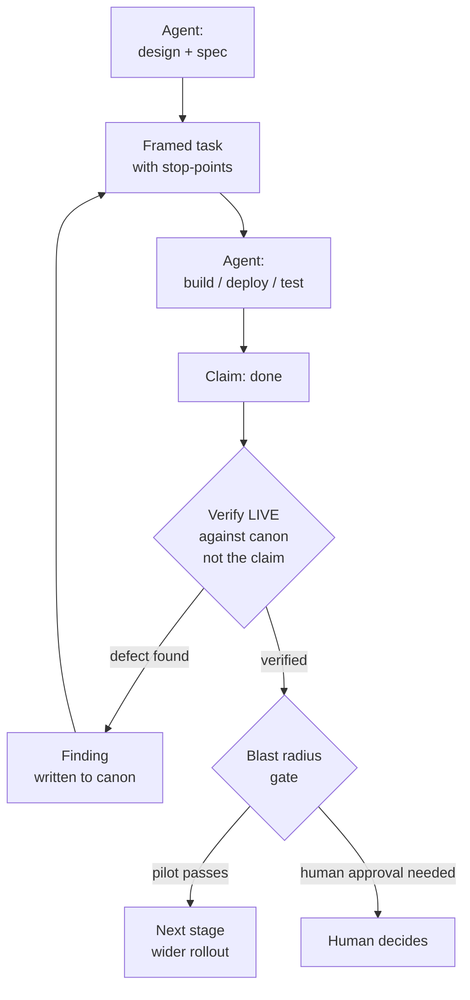

# The Canon-Grounded Agent

> The industry bet: more agents = better work. Our bet: **one agent grounded in verified canon +
> disciplined boundaries** produces more careful work than a swarm — at a fraction of the token cost.
> The quality was never in the head-count; it is in whether every claim is grounded in canon and
> verified against reality. This document is the pattern we actually run every day, including the
> failures that shaped it.

## The roles

| Role | Does | Never does |
|---|---|---|
| **Agent** (an advanced model) | architecture, design, execution, root-cause analysis, and **verifying its own claims against live ground truth** | trusting its own report over the live state; irreversible / outward-facing actions without approval |
| **Human** | policy, priorities, approval of irreversible / outward-facing changes | micromanaging the agent; hand-editing managed state |

In VSM terms (the lineage behind this): the agent spans **S1–S4** (operations + coordination + control
+ intelligence), the human is **S5** (policy). The load-bearing separation is not between two agents —
it is between **acting and verifying that action against canon**. The agent does both, but never lets
the second collapse into "I remember doing it." Canon is external to its reasoning; that externality is
what keeps the verification honest.

> **What guarantees the audit property.** That *what verifies a claim is not what produced it* does not
> require a second agent — it requires verification against **canon external to the agent's reasoning**.
> One agent that reads the artifact's hash instead of trusting its memory of the deploy has the guarantee
> on its own, at lower cost. (More agents remain a valid scaling — a reviewer plus an executor — where the
> coordination is worth it; the invariant is grounding, not the number of agents.)

## Where quality is actually made: the boundaries

The swarm assumption is that quality comes from adding workers. In practice, quality is made (or
lost) at four boundaries — none of which is *between two agents*; they are between **action and its
verification**, wherever that action originates:

**1. Framed tasks.** Every task is stated as a *framed contract*: a delimited, self-contained block
with context, exact scope, ordered steps, what NOT to touch, and an explicit stop-point. Whether the
human frames it for the agent or the agent frames a sub-task for itself, the discipline is the same —
no ambient context, no "you know what I mean."

**2. Verify live, never trust the report.** When the work reports "deployed and verified," the agent
checks the *live system* — the running process, the actual binary hash, the real log — not its own
account of it. This is the design assumption that **any** single observer, including yourself one step
ago, can be wrong about its own work. A new process running the OLD binary looks identical to success
until you check the hash.

**3. Confirm-first checkpoints.** Diagnosis before patching ("PASO 0"), pilot before fleet, one
service before 98. The agent stops and re-grounds at every point where the blast radius is about to
grow — *"establish the finding, then STOP before you patch."*

**4. Correction runs against the evidence, including your own conclusions.** The agent must be
correctable by ground truth even when it contradicts the agent's own prior reasoning. In our logs: a
fix was diagnosed as "algorithmically incomplete" — the live check proved it correct all along, it had
simply never been deployed (a stale build). A prescribed library parameter turned out absent from the
deployed version; the evidence forced a version-safe redesign. A pattern where a conclusion is never
overturned by the evidence is theater — authority is not being right, it is refusing unverified claims,
*your own most of all*.

## Who holds the pen: write-coherence

There is a fifth boundary, easy to miss because it isn't between the agents — it's between the
humans and the system.

The only way the system stays coherent across read and write runs is that **the system's managed
surfaces are written by the system**. The agent executes the changes and maintains the order; the
reconciler keeps the record ≡ reality. A human hand-edit to a managed surface — a state row, a
generated index, a tracked manifest — is **drift by definition**: a write the reconciler didn't see,
that the next read will faithfully repeat as truth.

This does *not* remove the human. It splits two things that are usually conflated:

- **Decisions flow through the human** — policy, priorities, approval of anything irreversible.
- **Writes flow through the system** — the human contributes *inputs* through declared channels
  (an agreed inbox directory, a task queue, a review verdict), and the agent turns them into
  reconciled state.

And yes — this includes **information architecture itself**. Folder taxonomies, documentation
indexes, "where things go": these are not a separate layer, they are just another domain under the
same primitive — a *declared* order (the index, the taxonomy) vs an *observed* reality (the actual
tree), with drift computed between them. In our own system the documentation index is
reconciler-controlled: editing it by hand is forbidden, not by etiquette but because a hand-edited
index is a lie the next agent will trust. If you can declare it and observe it, you can reconcile
it — files and folders included.

## The loop

Two properties matter. The loop **converges** — each round either verifies or produces a written
finding that narrows the next round. And it **fails small** — defects are caught at the pilot stage,
where the cost of being wrong is one service, not the fleet.

## Case study: four rounds to a fleet-safe fix

Real sequence, condensed from our logs. Context: a fleet of ~98 telemetry processes shared a defect
(clients hanging silently on broker disruption — a real 54-minute outage). The fix had to be right
before touching the fleet.

| Round | Delivered | Verifying live against canon found | Outcome |
|---|---|---|---|
| 1 | 3-layer resilience fix, chaos suite 11/11 green | the watchdog heartbeat ran on a timer *independent of the work* — a dead subscription would never trip it. **A green suite ≠ a working watchdog** | heartbeat re-gated on real work; decisive test added |
| 2 | work-gated watchdog, systemd test passes | the new health probe was a **busy-loop** (a no-op await returning in µs, not 30s) — confirmed empirically; ×98 it would have *caused* the very broker storm it guarded against | real interruptible wait; probe/watchdog ratio made explicit |
| 3 | pilot deployed | service stuck in `activating` forever: initial-connect retry looped without ever signaling readiness | two-phase connect (time-bounded attempts, then READY + background retry) |
| 4 | — | **reversal:** a prescribed fix used a parameter absent from the deployed library version; the live check caught it and forced a version-safe design | version-independent fix, verified live |

Four defects, all real, all caught **before** the fleet — each one found not by adding more agents,
but by refusing to accept an unverified claim. The pilot then ran a 24-hour observation window before
any wider rollout.

## Why this also saves tokens

The swarm burns tokens on re-derivation and coordination. This pattern attacks both:

- **Grounded state, not re-exploration** — the [state-canon](./README.md) puts reconciled ground truth
  in the agent's path (measured on a controlled corpus: a cold agent re-deriving state is always the
  most expensive condition; see [RESULTS](./corpus/microstack/RESULTS.md), including honest caveats).
- **No re-derivation tax** — grounding replaces the swarm's per-agent context rebuild; one grounded agent pays it once.
- **Compact machine-primary artifacts** — state, specs and handoffs are terse structured text, not prose.
- **Verification by query, not by re-reading** — "is this still true?" is one `state_verify` call.

## The disciplines (each one paid for by a real scar)

*Each is packaged as a portable, installable skill in [`skills/`](./skills/) — the rule, the scar,
and the anti-patterns, ready to drop into an agent's context.*

- **Verify live, not the report** — reports describe intentions; systems describe reality.
- **Confirm-first** — diagnose before patching; narrow before fixing.
- **Work-gated liveness** — a heartbeat decoupled from real work is theater (round 1 above).
- **Blast-radius gating** — one pilot before 98; a window of observation before "done."
- **Loud death** — services die noisily or not at all; silence is never health.
- **Fix the source, keep the detector** — never widen a threshold to quiet an alarm.
- **Logical gates, not time estimates** — "after X passes" beats "in about two hours." LLMs are
  reliably bad at duration; they are good at preconditions.
- **Framed prompts** — the handoff is a contract, not a conversation.
- **The system holds the pen** — managed surfaces (state, indexes, taxonomies) are written by the
  system, never hand-edited; humans contribute through declared input channels.

## Where this pattern does NOT fit (honest limits)

- **Massively parallel, independent subtasks** (crawl 500 pages, translate 200 files): a worker pool
  is simply right. The pattern governs *coupled, stateful, high-consequence* work.
- **No verifiable ground truth**: the pattern leans on a canonical state to verify against. Pure
  creative work has no `state_verify`.
- **Hard real-time**: verification adds latency by design. Reflex paths belong in deterministic code,
  not in any LLM loop (our rule D6/R10 — the LLM never sits on the safety-critical path).
- The token numbers we publish are **relative and corpus-bound** so far; treat them as direction, not
  gospel, until the publication-grade run ships.

## Lineage

This is Stafford Beer's Viable System Model made operational for agent teams — Cybersyn's bet
(Chile, 1971) that a *system with the right feedback structure* beats a bigger system without one.
Requisite variety is engineered into the boundaries (framing, verification, gating), not bought with
more agents.
