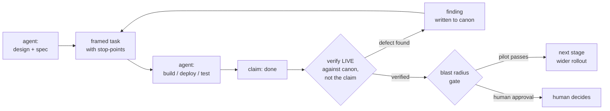

# state-canon — verified ground truth for agents

> **An agent grounded in verified canon does more careful work than one running on recall — and burns fewer tokens.**
> `state-canon` keeps a **canonical, reconciled record of the system** — the authoritative version of the
> world state, written on every change and reconciled against reality — and puts it *in the agent's path*,
> so the agent reasons from ground truth instead of stale memory or costly re-derivation. State you can
> query, verify, and govern.

**Status:** early / exploratory — the thesis and the method are battle-tested in daily use; the public
tooling is being extracted and **the token-savings claim is being measured, not proclaimed**. Full status
below. Stdlib-only, no dependencies. The method itself is a separate read: **[METHODOLOGY.md](./METHODOLOGY.md)**.

---

## The bet

The industry is racing toward multi-agent **swarms** on the premise that *more agents = better work*. We
take the opposite bet: the bottleneck was never *how many agents* — it's **whether each decision is grounded
in verified canon instead of the agent's own recall.** Fix that, and a **single agent** goes a long way, at
lower token cost.

- **One agent**, grounded in canon — it designs, executes, and *verifies its own claims against ground
  truth*, not against its memory of what it did.
- **A human** — sets policy and holds the ceiling: irreversible / outward-facing changes need approval.

The audit property that matters — *what verifies a claim is not what produced it* — holds with one
agent **because the canon is external to the agent's reasoning.** The agent doesn't check its work by
re-reading its own recall; it reconciles against a canonical store that reality writes to. The
full pattern — the single-agent loop, boundaries, the real case study — is in **[METHODOLOGY.md](./METHODOLOGY.md)**.



### Why it works

1. **Grounded, not re-derived.** The current, reconciled state of the system is injected into the agent's
   path. It doesn't re-explore the world each session; it reads verified ground truth. *This is what this
   tool provides.*
2. **Verify against canon, not recall.** The agent never trusts a *report* — its own or anyone's — over the
   live state ("is the service actually running?", not "did I say it is?"). Canon is the authority; recall
   is a lead to check.
3. **Compact, machine-primary artifacts.** State and handoffs are terse and structured, not prose — the
   token-cost lever.

## What it is — a canon layer, exposed over MCP

A **canonical store** written on every change, a **reconciler** that keeps it ≡ reality (drift / orphan
detection), and an *onboard* step that injects the current state into the model's context. The agent
queries it or has the digest front-loaded — either way it reads reconciled ground truth, not its own recall.
The discipline in one line: **recall is not canon — verify against state.**

Exposed over the Model Context Protocol so *any* agent can plug in:

| tool | does |
|---|---|
| `state_onboard()` | the whole current picture in one call (services + status, open drift, rules, last decision) |
| `state_query(domain, filter)` | a narrow slice, on demand |
| `state_verify(claim)` | ★ *don't trust the report — check it against ground truth* → `{holds, actual, evidence}` |
| `state_reconcile(domain)` | model≡reality → the drift / orphan report |
| `state_journal_mark(session_id?, drifts?)` | *opt-in (`--journal PATH`)* — save a session snapshot for later diff/trend |
| `state_journal_diff(from_id?, to_id?)` | *opt-in* — what changed between two snapshots |
| `state_journal_history(limit?)` | *opt-in* — recent snapshots |

Plus resources (`state://digest`, `state://schema`, `state://rules`, `state://handoff`) for clients that
inject context up front. The split is deliberate — **resources** feed the front-load (inject the digest at
session start); **tools** feed the lazy path (query only what you need).

**It's domain-agnostic.** You register your own `StateProvider` (SQLite, JSON, Git, an API — anything) and
a `Reconciler` (how to observe reality for each domain). Full abstraction, reference instances, the Git/VCS
instance, remote mode, and composing with other context sources: **[INTERFACE.md](./INTERFACE.md)**.

**It composes.** state-canon is one instrument, not the whole rack: attach it over MCP side-by-side with your
content RAG, your memory server, your other tools. The discipline that keeps the ensemble honest is
**authority ordering** — for *current* truth, reconciled state outranks memory and documents.

## Install

**Requirements:** Python **3.10+**. Nothing else — the server is stdlib-only, there is no `pip install`.

```bash
git clone https://github.com/rm-w3kufe/state-canon-mcp.git state-canon
python3 state-canon/tests/test_state_canon.py   # optional: 22 checks, ~1s
```

The server is one command (stdio; your MCP client spawns it):

```bash
python3 /abs/path/state-canon/mcp_server.py --state      /abs/path/your-state.json
python3 /abs/path/state-canon/mcp_server.py --sqlite     /abs/path/your-state.db     # any SQLite DB
python3 /abs/path/state-canon/mcp_server.py --git        /abs/path/your-repo         # a git working tree
python3 /abs/path/state-canon/mcp_server.py --microstack /abs/path/state-canon/corpus/microstack  # demo
```

> **Architecture note:** the server runs **locally, beside your agent** (stdio). Your state lives where
> your agent lives. It is not a network service and does not phone anywhere. (Remote *state* is supported at
> the provider layer — see [INTERFACE.md](./INTERFACE.md).)

### Per-client configuration

All stdio MCP clients need the same three facts: `command: python3`, `args: [launcher, --flag, path]`.
Use **absolute paths** everywhere.

**Claude Code (CLI):**
```bash
claude mcp add state-canon -- python3 /abs/path/state-canon/mcp_server.py --state /abs/path/state.json
```
or per-project in `.mcp.json` / **Claude Desktop** in `claude_desktop_config.json`:
```json
{ "mcpServers": { "state-canon": {
    "command": "python3",
    "args": ["/abs/path/state-canon/mcp_server.py", "--state", "/abs/path/state.json"] } } }
```

**OpenCode** (`opencode.json`, 0.x shape):
```json
{ "mcp": { "state-canon": {
    "type": "local",
    "command": ["python3", "/abs/path/state-canon/mcp_server.py", "--state", "/abs/path/state.json"] } } }
```

**Cursor** (`.cursor/mcp.json`), **Cline** (`cline_mcp_settings.json`), **Windsurf**
(`~/.codeium/windsurf/mcp_config.json`) — all use the same `mcpServers` shape as Claude Desktop above.

### Verify the install (no client needed)

```bash
printf '%s\n' '{"jsonrpc":"2.0","id":1,"method":"initialize","params":{}}' \
  | python3 /abs/path/state-canon/mcp_server.py --microstack /abs/path/state-canon/corpus/microstack
```

You should see one JSON line with `"serverInfo": {"name": "state-canon"}`.

### Updating

state-canon-mcp is a plain `git clone`, not a package — updating is a `git pull`:

```bash
cd state-canon && git pull
```

Check what changed: **[CHANGELOG.md](./CHANGELOG.md)**, or `git log --oneline v0.2.0..HEAD`
against the version your `initialize` response currently reports.

Your own customizations are safe across an update: a `--state` JSON file, a
`--sqlite`/`--git` target, or a full `--instance` module all live **outside** this repo
and are loaded at runtime — a `git pull` never touches them. The only thing that could
break a custom instance is a breaking change to the `StateProvider` / `Reconciler`
interface itself, and that would always be called out under `### Changed` in the
changelog, never buried in `### Added`.

## Quickstart — the 60-second demo

The repo ships a tiny fictional deployment (`corpus/microstack/`) with **three seeded drifts**: a service
declared active but actually stopped, a rule violation, and an orphan process.

**1. Ask for the whole picture:**
```bash
cd state-canon
printf '%s\n' '{"jsonrpc":"2.0","id":1,"method":"tools/call","params":{"name":"state_onboard","arguments":{}}}' \
  | python3 mcp_server.py --microstack corpus/microstack
```
→ one compact digest: 9 services, the 3 drifts (recomputed live from the raw files, not read from a
snapshot), the rules, the last recorded decision.

**2. Catch a lie** — claim that `cache` is running, against ground truth:
```bash
printf '%s\n' '{"jsonrpc":"2.0","id":1,"method":"tools/call","params":{"name":"state_verify","arguments":{"domain":"services","filter":{"name":"cache"},"expect":{"actual":"running"}}}}' \
  | python3 mcp_server.py --microstack corpus/microstack
```
→ `"holds": false` **with evidence**: declared `active`, observed `stopped`. That is the whole philosophy in
one call: *don't trust the report — verify against state.*

**3. With your agent attached**, ask it:
- *"What's the current state of the system? Any drift?"* → it calls `state_onboard` once.
- *"Is the cache service consistent with what's declared?"* → it calls `state_query` / `state_verify`.

**The usage pattern that measured best** (see [Measured](#measured-not-proclaimed)): **inject the digest
once at session start** (cheapest for broad questions), then **use targeted `state_query` for follow-ups**
(cheapest for narrow ones). Cold re-exploration is always the most expensive.

## Onboarding your system — three steps

### Step 1 — point the server at your state

**JSON (quickest start).** Any JSON document whose top-level keys hold lists of records:
```json
{ "system": "my-stack",
  "services": [ {"name": "api", "state": "running", "version": "1.2.0"} ],
  "rules":    [ "api and worker versions must match" ],
  "last_decision": {"id": "D-1", "text": "approved cache upgrade"} }
```
```bash
python3 mcp_server.py --state /abs/path/my-state.json
```

**SQLite.** Every table/view becomes a queryable domain automatically — or pass an explicit mapping (see
`instances/sqlite_ops.py` for a real production example). Opened read-only by construction (`mode=ro`):
```python
from state_canon.sqlite_provider import SqliteStateProvider
provider = SqliteStateProvider("ops.db",
    domains={"services": "services", "blockers": "v_open_blockers"},
    meta={"system": "my-stack"})
```

**Git.** `--git /path/to/repo` — the working tree becomes a live drift report (see [INTERFACE.md](./INTERFACE.md)).

**An API / anything.** Implement two methods (this **is** remote mode — the server stays local, the
provider crosses the wire; an SSH-channel provider is the same shape):
```python
from state_canon.provider import StateProvider
import json, urllib.request

class ApiStateProvider(StateProvider):
    def __init__(self, base_url): self.base = base_url
    def list_domains(self): return ["services", "incidents", "meta"]
    def query(self, domain, filter=None):
        if domain == "meta": return [{"system": "my-stack"}]
        with urllib.request.urlopen(f"{self.base}/{domain}") as r: records = json.load(r)
        if filter: records = [x for x in records if all(x.get(k) == v for k, v in filter.items())]
        return records
```

### Step 2 — shape the digest (what matters at onboard)

Raw dumps don't belong in a model's context (our first real-canon digest weighed 44k chars; the policy cut
it to 12k). Declare what matters per domain — detail is never lost, it stays one `state_query` away:
```python
DIGEST_POLICY = {
    "services": {"fields": ["name", "state", "version"], "max": 60},
    "deploys":  {"fields": ["component", "result"], "max": 5, "last": True},
    "audit_log": {"skip": True},          # queryable, but not onboard material
}
```

### Step 3 (optional but recommended) — add a reconciler

This is where canon earns its keep: **declared vs observed → typed drift**, computed live.
```python
from state_canon.reconcile import Reconciler

class MyReconciler(Reconciler):
    domain = "services"
    def declared(self):   # the model: your manifest / DB / config
        return load_manifest()
    def observe(self):    # the reality: ps, systemctl, an API probe...
        return probe_running_processes()
```
The generic diff yields `declared_but_missing`, `orphan`, and your registered `rule_violation`s — exactly
the three drift kinds seeded in the demo. Wire it in an instance module (`instances/microstack.py` is the
40-line reference).

## Use cases

| Scenario | Call pattern |
|---|---|
| Agent session start — "where am I?" | `state://digest` resource injected, or one `state_onboard` |
| "Is service X ok?" mid-session | `state_query(services, {name: X})` — ~80 tokens |
| Reviewing another agent's (or person's) report | `state_verify(domain, filter, expect)` → holds/mismatches + evidence |
| Post-deploy sanity | `state_reconcile()` → live drift list (orphans, missing, rule violations) |
| CI gate | run the reconcile in a script; fail the pipeline if drift ≠ expected |

## Measured, not proclaimed

We refuse to ship a token-savings number we haven't earned. [EXPERIMENT.md](./corpus/microstack/EXPERIMENT.md)
defines a reproducible experiment: the same tasks run **cold** (agent re-explores) vs **onboard** (state
injected) vs **MCP** (state queried), on a small controlled corpus, same model, ≥5 trials, **scored for
correctness** (savings that produce a wrong answer are disqualified). The honest finding is a *trade-off* —
onboard wins broad tasks, lazy MCP wins narrow ones, cold always loses — reported that way in
[RESULTS.md](./corpus/microstack/RESULTS.md), caveats and all.

## Status (honest)

| piece | state |
|---|---|
| Thesis + method | ✅ in daily use |
| MCP server (stdlib-only) | ✅ 22/22 checks + end-to-end stdio smoke |
| Controlled corpus + experiment | ✅ trade-off characterized (onboard wins broad, lazy query wins narrow, cold always loses; correctness intact) |
| Second living instance (SQLite over a real production canon) | ✅ 14/14 structural checks; digest policy born from a real 44k→12k lesson |
| Git/VCS instance | ✅ `GitStateProvider` + reconciler (`--git`); the three drift kinds fall out of `git status`; read-only; 17/17 checks |
| Remote mode (remote state, local server) | ✅ by design at the provider layer; remote MCP *transport* = open integration point, not shipped |
| Session journal (snapshot / diff / trend) | ✅ opt-in via `--journal`; 28/28 checks incl. degrade-to-zero on non-BBH data |
| Skills (9) + agent spec (1) | ✅ the disciplines and the single-agent spec, installable |
| Publication-grade token counters (real MCP attach + billed usage) | ⬜ pending |
| Realistic corpus + published numbers | ⬜ after validation |

*Legend: ✅ built and tested · ⬜ declared/roadmap. `METHODOLOGY.md`, `skills/` and `agents/` are practice
documentation (the pattern we run daily), not orchestration code — nothing here pretends to be what it isn't.*

## Going deeper

- **[METHODOLOGY.md](./METHODOLOGY.md)** — the canon-grounded agent: roles, the four boundaries where quality
  is made, the real four-round case study, and the honest limits.
- **[INTERFACE.md](./INTERFACE.md)** — extending & integrating: the provider abstraction, reference
  instances, the Git/VCS instance, remote mode, and composing with other context sources.
- **[skills/](./skills/)** — the nine disciplines as portable, installable skills (each with its scar).
- **[agents/](./agents/)** — the agent as an adoptable spec (`agent.md`).
- **[corpus/microstack/](./corpus/microstack/)** — the measurement corpus, experiment design, and results.
- **[CHANGELOG.md](./CHANGELOG.md)** — what changed, by version.

## Repository layout

```
state-canon/
├── README.md            ← this file (what it is · install · usage · status)
├── METHODOLOGY.md       ← the canon-grounded agent (the method behind the tool)
├── INTERFACE.md         ← extending & integrating (abstraction · git · remote · composition)
├── skills/              ← the disciplines as portable skills (9 · installable in Claude Code)
├── agents/              ← the agent as an adoptable spec
├── mcp_server.py        ← one-file launcher for any MCP client
├── state_canon/           ← the library (stdlib): provider · sqlite_provider · git_provider · reconcile · digest · journal · server
├── instances/           ← reference instances (microstack demo · a real SQLite canon · git)
└── corpus/microstack/   ← controlled measurement corpus
    ├── raw/             ← what a COLD agent faces (must synthesize)
    ├── synthesized/     ← the reconciled state (the canon's product)
    ├── EXPERIMENT.md · RESULTS.md · GROUND_TRUTH.md · TASKS.md
```

## Lineage & philosophy

Built on Stafford Beer's **Viable System Model** and the **Cybersyn** project (Chile, 1971) — a system is
viable when it can be *described*, *governed*, and *audited*. "Don't trust, verify" isn't a slogan here;
it's the reconciler and the verify-at-every-boundary discipline made mechanical. Community-first, and
deliberately **from the Global South** — the heir to Cybersyn's bet that good cybernetics serves people.

## License

Code: **Apache-2.0** ([LICENSE](./LICENSE)) · Docs: **CC-BY-4.0**.

This module is deliberately more permissive than the AGPL core it was extracted from — it is meant to be
adopted, embedded, and improved by the community. Improvements can flow back; the module stays clean of
AGPL code by construction.
